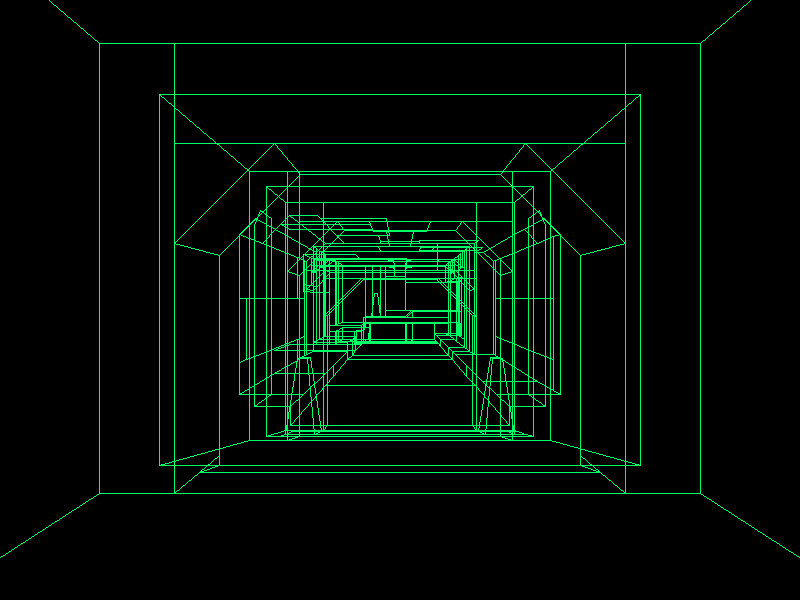
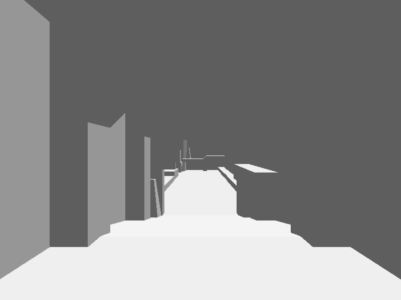

# pq.ai — Quake in pure Python

A working slice of Quake written in **pure Python standard library**, with
**tkinter as the only UI dependency**. No numpy, no pygame, no OpenGL, no C extensions.

It loads the genuine Quake shareware data, parses a real BSP level, runs id's
**actual compiled game code** (`progs.dat`) in a QuakeC virtual machine, and renders
it three ways — wireframe, flat-shaded polygons, or a **textured software rasteriser
with baked lightmaps**. You can fight the monsters, pick up items, ride the lifts,
take the slipgates, die, and respawn.




## Run

You need the Quake shareware data (id Software copyright — free to download, not
redistributed here) at `quake-shareware/id1/pak0.pak`. Fetch it — and the GPL
reference source under `quake-source/` — with the one-shot setup script (pure
stdlib, no git required, idempotent):

```bash
python setup.py               # downloads shareware data + GPL reference source
python setup.py --skip-source # just the shareware data (pak0.pak)
```

The shareware download defaults to a public archive.org mirror; override it with
`--shareware-url URL` or `$QUAKE_SHAREWARE_URL` if the mirror moves. Then:

```bash
python main.py e1m1           # gdi32 on Windows, tkinter elsewhere; also e1m2…e1m8, start
python main.py --tk e1m1      # force tkinter on Windows
```

**Controls**

- Click the window to capture the mouse, then `WASD` + mouse to move and look.
- **Mouse or `Ctrl` to fire**; `1`–`8` select weapons (Quake's impulse binds).
- `Space` / `C` swim/fly up/down, `Shift` faster.
- `Tab` toggle mouse-look, `Esc` release / quit.
- Render modes: `F` flat-shaded, `Z` textured z-buffer, `T` toggle texturing, `N` noclip.

## How it works

The platform-agnostic engine lives in the **`quake/`** package. The UI-agnostic
`Client` core and both frontends live outside it (at the repo root), so the engine
imports nothing OS- or UI-specific. Sound is split the same way: the mixer is
portable; only the output stream is platform code.

| File | Role |
|------|------|
| `quake/pak.py` | PAK archive reader (`"PACK"` header + 64-byte directory entries) |
| `quake/bsp.py` | BSP v29 parser → flat arrays of tuples; entity/spawn parsing; texinfo, embedded miptex decode, and the lightmap (`LIGHTING`) lump |
| `quake/mdl.py` | Alias model (`.mdl`) reader: header, skins, triangles, and per-frame vertex sets (single + time-animated groups), decoded to float positions |
| `quake/progs.py` | `progs.dat` (QuakeC v6) loader: statements, defs, functions, a growable string heap, and the globals block as one buffer with aliased float/int views (the `eval_t` union) |
| `quake/pr_exec.py` | The QuakeC bytecode interpreter — `PR_ExecuteProgram`'s opcode loop, call frames, and a flat integer-indexed edict store (all edict fields in one buffer, edict *N* at *N·edict_size*) |
| `quake/sv.py` | Server layer: the ~70 builtins (`pr_cmds.c`), entity spawning from the BSP string (`ED_LoadFromFile`), the think/movetype frame loop, the player edict, weapon firing, combat/damage, monster movement, and the death→respawn path. Runs id's **actual compiled game code** |
| `quake/physics.py` | Clip-hull tracing + player movement (gravity, friction, accel, 18u stairs) — ported from `SV_RecursiveHullCheck` / `SV_WalkMove`. Backs the collision builtins (`traceline`, `walkmove`, `movetogoal`, `droptofloor`) |
| `quake/render.py` | Three renderers — **wireframe** (PVS → backface cull → near-clip edges → project), **flat-shaded** (BSP painter's order → near-clip polygons → filled `create_polygon`), and a **textured z-buffer software rasteriser** (perspective-correct texels modulated by baked lightmaps, per-pixel 1/z depth). Lightmaps animate with **light styles** (flickering/pulsing lights); **special surfaces animate** — sky scrolls, liquids/teleporters sine-warp, `+N` textures cycle at 5 Hz. Draws the world, brush-model **entities**, and **alias models** (monsters/items), all PVS-culled |
| `quake/snd.py` | Platform-agnostic software sound mixer — a port of `S_PaintChannels` / `SND_Spatialize`. Decodes/resamples once at precache; `mix(nframes)` sums active voices to 16-bit stereo with distance attenuation + stereo pan re-panned every frame. Touches no OS — a backend pulls from it |
| `client.py` | UI-agnostic game client: the `Client` core holds the engine stack + all camera/player/game state and exposes `frame(dt, input) -> RenderFrame`; the `InputState` / `RenderFrame` dataclasses are the only contracts shared by the two frontends |
| `main.py` | tkinter frontend (all platforms; default off-Windows and via `--tk` on Windows): `after()` game loop, Canvas/`PhotoImage` drawing, warp-based mouselook. `select_frontend(argv, platform)` decides which frontend to launch |
| `win_gdi.py` | gdi32 Windows frontend (the default on Windows): owns a `PeekMessage` game loop and Win32 raw-input mouselook + cursor grab, draws via `win_ui.GdiBlitter` (StretchDIBits / Polyline / Polygon / FillRect / TextOut). Exists because tkinter owns the message pump and the software render blocks it, so raw mouse input backlogs — a dedicated loop that drains all input each frame fixes that |
| `win_ui.py` | Windows GDI helpers: `GdiBlitter` (StretchDIBits / vector / text presenter) plus the raw-input ctypes structs and helpers (`RAWINPUT`, `RAWINPUTDEVICE`, `raw_mouse_delta`, etc.) that `win_gdi.py` uses for its own WndProc; pure helpers unit-tested in `test_win_ui.py` |
| `mac.py` | macOS audio backend (outside the package): one 16-bit stereo CoreAudio `AudioQueue` stream via ctypes, whose realtime callback pulls samples from the mixer |
| `win.py` | Windows audio backend (outside the package): a pool of `winmm` `waveOut` buffers via ctypes; a feeder thread waits on the device's completion event and refills each finished buffer from the mixer |

**Three ways to draw, three sets of tradeoffs.** Wireframe needs **no framebuffer** —
edges go straight to `Canvas.create_line` (C-implemented), and PVS + backface culling
cut a ~5,500-face level to a few hundred visible edges per frame. Flat shading fills
`create_polygon`s back-to-front via the BSP (no z-buffer needed). The textured mode is a
real per-pixel software rasteriser: it owns a 1/z depth buffer (so intersecting geometry
sorts correctly), samples each face's texture perspective-correctly, and modulates it by
the baked lightmap luxel covering each pixel. Pure-Python per-pixel fill is slow, so it
renders at **1/4 window resolution** into a packed-RGB buffer the UI scales up.

**Where the time goes (wireframe):** the Python render math is only ~2 ms/frame — the
bottleneck is tkinter rasterizing the lines. So the optimizations that matter all reduce
work *for Tk*: a pre-grown line pool (no `create_line` hitches), parking unused lines
off-screen with `coords()` instead of `itemconfig(state=...)`, and dropping sub-pixel
segments. Typical: ~520 fps on e1m1 wireframe, far less in textured mode (every lit pixel
is a Python loop iteration).

## Status

**Playable.** All episode-1 shareware maps load, render, and run the genuine game logic.

- **Movement & collision** — gravity, floor/wall sliding, 18-unit stair stepping, jumping,
  swimming, and `N` noclip flight, all against real Quake clip hulls.
- **Game logic** — a **QuakeC virtual machine** spawns the whole entity list, runs each
  spawn function, and ticks every think chain at 10 Hz. Doors, lifts, buttons and
  triggers are real entities; their brush models draw at the origins the QC sets, and you
  trigger them by walking into them (the player edict drives touch/trigger).
- **Combat** — weapons fire through the game's own QuakeC (`W_WeaponFrame`: per-weapon
  cadence, ammo, view-model animation). Hitscan and projectiles damage monsters; monsters
  damage you. **Monster AI navigates** — the collision builtins are wired to `physics.py`,
  so a grunt acquires the player by line-of-sight and walks toward them.
- **Items, death, levels** — pickups (health/ammo/weapons) work and disappear when taken;
  dying runs the real `PlayerDie`/`PlayerDeathThink` sequence and respawns the level on
  fire; slipgates change level; the end-of-level **intermission** camera works.
- **Lighting & surfaces** — baked **lightmaps** from the `LIGHTING` lump light the
  textured world and the alias models, **light styles** animate flickering lights, and
  **special surfaces animate**: scrolling sky, sine-warped water/lava/slime/teleporters
  (drawn full-bright), and `+N` animated wall textures.
- **Sound** — 3D positional audio via a software mixer feeding CoreAudio (macOS) or winmm `waveOut` (Windows).

**Not there:** menus, save/load, networking (single-player against the compiled progs
only), particles beyond the basic point sprites, and a true two-layer parallax sky (the
sky is a single scrolling layer). Sound runs on **macOS** (CoreAudio) and **Windows**
(winmm `waveOut`), both via ctypes; Linux still runs muted. The
textured rasteriser runs at quarter resolution to stay interactive in pure Python.
