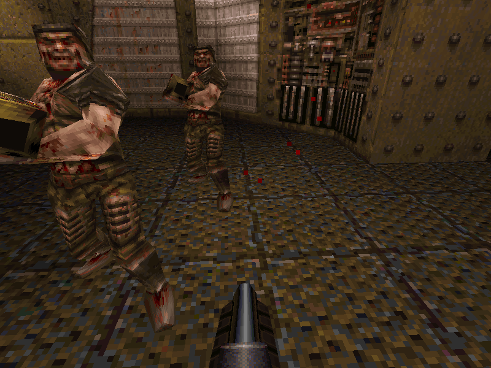
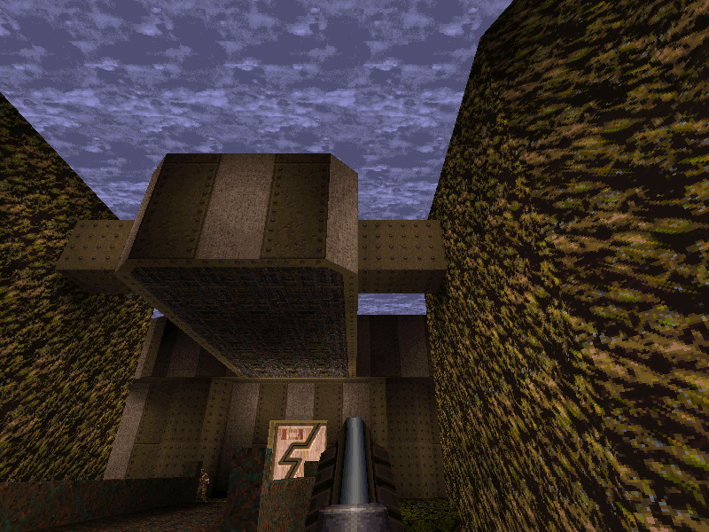

# pq.ai — Quake in pure Python

A working slice of Quake written in **pure Python standard library** — the only
non-stdlib dependencies are UI frontends: **PyObjC** for the native macOS frontend
and **tkinter** for the fallback/Linux frontend. No numpy, no pygame, no OpenGL,
no C extensions.

It loads the genuine Quake shareware data, parses a real BSP level, runs id's
**actual compiled game code** (`progs.dat`) in a QuakeC virtual machine, and renders
it three ways — wireframe, flat-shaded polygons, or a **textured software renderer**:
a faithful port of WinQuake's span/edge scanline engine, with baked lightmaps, light
styles, the two-layer scrolling sky, warping liquids, particles and dynamic lights.
You can fight the monsters, pick up items, ride the lifts, take the slipgates, die,
and respawn.






## Run

You need the Quake shareware data (id Software copyright — free to download, not
redistributed here) at `quake-shareware/id1/pak0.pak`. Fetch it — and the GPL
reference source under `quake-source/` — with the one-shot setup script (pure
stdlib, no git required, idempotent):

```bash
python setup.py               # downloads shareware data + GPL reference source
python setup.py --skip-source # just the shareware data (pak0.pak)
```

The shareware download defaults to a public archive.org mirror; override it with
`--shareware-url URL` or `$QUAKE_SHAREWARE_URL` if the mirror moves. Then:

```bash
python main.py e1m1           # gdi32 on Windows, Cocoa on macOS, tkinter elsewhere; also e1m2…e1m8, start
python main.py --tk e1m1      # force the tkinter fallback (Windows and macOS)
```

The macOS frontend needs PyObjC (`pip install pyobjc-framework-Cocoa
pyobjc-framework-Quartz`); without it, `--tk` runs on any Python with tkinter.

**Controls**

- Click the window to capture the mouse, then `WASD` + mouse to move and look.
- **Mouse or `Ctrl` to fire**; `1`–`8` select weapons (Quake's impulse binds).
- `Space` / `C` swim/fly up/down, `Shift` faster.
- `Tab` toggle mouse-look (releases the cursor).
- Render modes: `F` flat-shaded, `Z` textured, `T` toggle texturing, `N` noclip.
- `F1` (or `` ` ``) the drop-down console; `Esc` the overlay menu (resolution / quit);
  `P` the profiler HUD (per-frame section milliseconds, with a frametime sparkline).
- Console commands: `map`, `save`/`load`, `god`, `give`, cvars via `set`,
  `logperf [file]` to record per-frame timings to CSV (defaults to a timestamped
  `perf-<ISO>.csv`; run again to stop) — `cmdlist` for the rest.

## How it works

The platform-agnostic engine lives in the **`quake/`** package. The UI-agnostic
`Client` core and both frontends live outside it (at the repo root), so the engine
imports nothing OS- or UI-specific. Sound is split the same way: the mixer is
portable; only the output stream is platform code.

| File | Role |
|------|------|
| `quake/pak.py` | PAK archive reader (`"PACK"` header + 64-byte directory entries) |
| `quake/bsp.py` | BSP v29 parser → flat arrays of tuples; entity/spawn parsing; texinfo, embedded miptex decode, and the lightmap (`LIGHTING`) lump |
| `quake/mdl.py` | Alias model (`.mdl`) reader: header, skins, triangles, and per-frame vertex sets (single + time-animated groups), decoded to float positions |
| `quake/progs.py` | `progs.dat` (QuakeC v6) loader: statements, defs, functions, a growable string heap, and the globals block as one buffer with aliased float/int views (the `eval_t` union) |
| `quake/qcc/` | Pure-Python QuakeC compiler (the inverse of `progs.py`): compiles `progs.src` + `.qc` sources → a v6 `progs.dat`, byte-identical to id's qccdos.exe. Public API: `compile_progs_src(path) -> bytes`. Run: `python -m quake.qcc -src DIR` |
| `quake/pr_exec.py` | The QuakeC bytecode interpreter — `PR_ExecuteProgram`'s opcode loop, call frames, and a flat integer-indexed edict store (all edict fields in one buffer, edict *N* at *N·edict_size*) |
| `quake/sv.py` | Server layer: the ~70 builtins (`pr_cmds.c`), entity spawning from the BSP string (`ED_LoadFromFile`), the think/movetype frame loop, the player edict, weapon firing, combat/damage, monster movement, and the death→respawn path. Runs id's **actual compiled game code** |
| `quake/physics.py` | Clip-hull tracing + player movement (gravity, friction, accel, 18u stairs) — ported from `SV_RecursiveHullCheck` / `SV_WalkMove`. Backs the collision builtins (`traceline`, `walkmove`, `movetogoal`, `droptofloor`) |
| `quake/render.py` | Three renderers — **wireframe** (PVS → backface cull → near-clip edges → project), **flat-shaded** (BSP painter's order → near-clip polygons → filled `create_polygon`), and the **textured software renderer**: world and brush-model occlusion resolved per-span by the span/edge engine (`r_edge.py`), spans filled with perspective-correct texels from a lit-surface cache à la `D_CacheSurface`, into an **8-bit palette-indexed framebuffer** lit through `colormap.lmp` exactly like WinQuake. Alias models (monsters/items), `.spr` sprites, particles and the view model draw afterward against the 1/z buffer the spans wrote. Lightmaps animate with **light styles** plus **dynamic lights** (rocket glow, explosions); **special surfaces animate** — the two-layer sky scrolls (drawn unlit, `D_DrawSkyScans8`), liquids/teleporters sine-warp, `+N` textures cycle |
| `quake/r_edge.py` | The span/edge scanline occlusion engine — a faithful port of WinQuake's `r_edge.c`: per-scanline active-edge list, the keyed surface stack (BSP front-to-back keys from `R_RecursiveWorldNode`, brush models keyed by leaf or BSP-clipped per fragment), id's coplanar tie-breaks and inverted-span guards. Each visible surface comes out as horizontal spans — zero overdraw, no per-pixel depth compare for world geometry |
| `quake/spr.py` | `.spr` sprite parser (explosions, bubbles, torch flames), billboarded like `R_DrawSprite` |
| `quake/menu.py` | UI-agnostic overlay menu state machine behind `Esc` (resolution switch, quit) |
| `quake/perf.py` | Always-on per-frame section profiler (server / render / raster / present), EMA-smoothed; `P` draws the HUD bar chart + frametime sparkline; `logperf` writes raw per-frame CSV |
| `quake/snd.py` | Platform-agnostic software sound mixer — a port of `S_PaintChannels` / `SND_Spatialize`. Decodes/resamples once at precache; `mix(nframes)` sums active voices to 16-bit stereo with distance attenuation + stereo pan re-panned every frame. Touches no OS — a backend pulls from it |
| `quake/console.py` | Quake-style console: command/cvar/alias registry, line editor, history, tab-completion, scrollback; pure (no OS/UI). Both frontends open it with F1 / `` ` `` |
| `client.py` | UI-agnostic game client: the `Client` core holds the engine stack + all camera/player/game state and exposes `frame(dt, input) -> RenderFrame`; the `InputState` / `RenderFrame` dataclasses are the only contracts shared by the two frontends |
| `main.py` | tkinter frontend (the fallback: `--tk` anywhere, default on Linux): `after()` game loop, Canvas/`PhotoImage` drawing, warp-based mouselook. `select_frontend(argv, platform)` decides which frontend to launch |
| `win_gdi.py` | gdi32 Windows frontend (the default on Windows): owns a `PeekMessage` game loop and Win32 raw-input mouselook + cursor grab, draws via `win_ui.GdiBlitter` (StretchDIBits / Polyline / Polygon / FillRect / TextOut). Exists because tkinter owns the message pump and the software render blocks it, so raw mouse input backlogs — a dedicated loop that drains all input each frame fixes that |
| `mac_cocoa.py` | Cocoa macOS frontend (the default on macOS, via PyObjC): owns an `NSEvent` pump loop (the same drain-then-step structure as win_gdi), relative-delta mouselook (`CGAssociateMouseAndMouseCursorPosition` — no warp hack), and draws with CoreGraphics in an `NSView.drawRect:` (framebuffer `CGImage` blit, batched segments/paths, AppKit text) |
| `mac_ui.py` | macOS UI helpers: pure half (keycode map, fb→RGBA expansion, letterbox/particle fit; unit-tested in `tests/test_mac_ui.py`) + CG drawing half (fb CGImage, vectors, text, console/menu panels) used by `mac_cocoa.py` |
| `win_ui.py` | Windows GDI helpers: `GdiBlitter` (StretchDIBits / vector / text presenter) plus the raw-input ctypes structs and helpers (`RAWINPUT`, `RAWINPUTDEVICE`, `raw_mouse_delta`, etc.) that `win_gdi.py` uses for its own WndProc; pure helpers unit-tested in `tests/test_win_ui.py` |
| `mac.py` | macOS audio backend (outside the package): one 16-bit stereo CoreAudio `AudioQueue` stream via ctypes, whose realtime callback pulls samples from the mixer |
| `win.py` | Windows audio backend (outside the package): a pool of `winmm` `waveOut` buffers via ctypes; a feeder thread waits on the device's completion event and refills each finished buffer from the mixer |

**Three ways to draw, three sets of tradeoffs.** Wireframe needs **no framebuffer** —
edges go straight to `Canvas.create_line` (C-implemented), and PVS + backface culling
cut a ~5,500-face level to a few hundred visible edges per frame. Flat shading fills
`create_polygon`s back-to-front via the BSP (no z-buffer needed). The textured mode is
WinQuake's actual architecture: the BSP walk emits each visible face's screen edges
into the **span/edge engine** (`r_edge.py`, a port of `r_edge.c`), which sweeps a
per-scanline active-edge list over a surface stack keyed in BSP front-to-back order —
occlusion is decided **once per span**, not per pixel, so world geometry has zero
overdraw and coplanar lift/door faces can't z-fight. Surviving spans are filled with
perspective-correct texels (1/z, u/z, v/z are linear in screen space — one add per
pixel) from a **surface cache**: the face's texture mapped through the `colormap.lmp`
row of each lightmap luxel, rebuilt only when a light style or dynamic light changes
it (id's `D_CacheSurface`). The spans also write 1/z, and alias models, sprites,
particles and the view model then draw with a per-pixel depth test against it. The
framebuffer is **8-bit palette indices** — one byte per pixel, WinQuake's actual
pipeline, which also makes fullbright texels (lamps, screens) glow in the dark —
blitted as a palettised 8bpp DIB on gdi32 and expanded through the palette on tk.
Pure-Python per-pixel fill is still slow, so it renders at **1/4 window resolution**
(or a fixed resolution from the `Esc` menu; `zbuf_scale` cvar) and the UI scales up.

**Where the time goes (wireframe):** the Python render math is only ~2 ms/frame — the
bottleneck is tkinter rasterizing the lines. So the optimizations that matter all reduce
work *for Tk*: a pre-grown line pool (no `create_line` hitches), parking unused lines
off-screen with `coords()` instead of `itemconfig(state=...)`, and dropping sub-pixel
segments. Typical: ~520 fps on e1m1 wireframe, far less in textured mode (every lit pixel
is a Python loop iteration).

## Status

**Playable.** All episode-1 shareware maps load, render, and run the genuine game logic.

- **Movement & collision** — gravity, floor/wall sliding, 18-unit stair stepping, jumping,
  swimming, and `N` noclip flight, all against real Quake clip hulls.
- **Game logic** — a **QuakeC virtual machine** spawns the whole entity list, runs each
  spawn function, and ticks every think chain at 10 Hz. Doors, lifts, buttons and
  triggers are real entities; their brush models draw at the origins the QC sets, and you
  trigger them by walking into them (the player edict drives touch/trigger).
- **Combat** — weapons fire through the game's own QuakeC (`W_WeaponFrame`: per-weapon
  cadence, ammo, view-model animation). Hitscan and projectiles damage monsters; monsters
  damage you. **Monster AI navigates** — the collision builtins are wired to `physics.py`,
  so a grunt acquires the player by line-of-sight and walks toward them.
- **Items, death, levels, saves** — pickups (health/ammo/weapons) work and disappear
  when taken; dying runs the real `PlayerDie`/`PlayerDeathThink` sequence and respawns
  the level on fire; slipgates change level (inventory carried across); the end-of-level
  **intermission** camera works; `save`/`load` use the original `.sav` format.
- **Lighting & surfaces** — baked **lightmaps** from the `LIGHTING` lump light the
  textured world and the alias models, **light styles** animate flickering lights,
  **dynamic lights** glow (rockets, explosions), and **special surfaces animate**: the
  two-layer scrolling sky (drawn unlit, like `D_DrawSkyScans8`), sine-warped
  water/lava/slime/teleporters (full-bright), and `+N` animated wall textures.
- **Effects** — particles are a faithful `r_part.c` port (per-type physics, colour
  ramps, rocket/grenade trails, blood, teleport splashes), explosions use the real
  `.spr` sprites, and lightning beams render as segmented bolt models.
- **Sound** — 3D positional audio via a software mixer feeding CoreAudio (macOS) or
  winmm `waveOut` (Windows), with ambient water/sky loops from the BSP's leaf data.

**Not there:** networking (single-player against the compiled progs only), demos,
CD-audio music, and a proper main menu (the `Esc` overlay does resolution + quit).
Linux runs muted until someone writes an audio backend. The textured renderer runs
at quarter resolution to stay interactive in pure Python.
